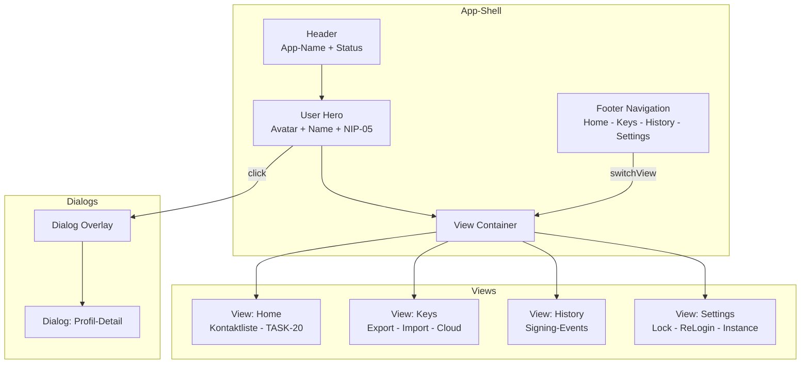

# TASK-16: Popup-Redesign – Implementierungsplan

## Übersicht

Umbau des bestehenden scroll-basierten Popups in eine moderne App-Shell mit Footer-Navigation und Dialog-basiertem View-System.

## Analyse des Bestehenden

### Aktuelle Struktur (popup.html)
```
<main class="popup">
  <h1>WP Nostr Signer</h1>
  <section class="profile-section">...</section>     <!-- Profil, Pubkeys, Publish -->
  <label class="row">WP-Nostr-Lock</label>
  <section class="unlock-section">...</section>      <!-- ReLogin-Dauer -->
  <section class="backup-section">...</section>      <!-- Export, Import, Create, Cloud -->
  <section class="instance-section">...</section>    <!-- WP-Instanz Info -->
  <p id="status"></p>
</main>
```

### Design-Tokens (bereits in popup.css)
- `--bg`, `--surface`, `--surface-2`, `--text`, `--muted`, `--border`
- `--accent`, `--accent-strong`, `--accent-soft`, `--accent-glow`
- `--danger`, `--danger-bg`, `--success`
- `--shadow`, `--radius`
- Dark/Light Mode via `prefers-color-scheme`

### JavaScript-Funktionen (popup.js - 1332 Zeilen)
- Viewer-Kontext laden (`loadViewerContext`, `fetchWpViewer`)
- Profil-Rendering (`renderProfileCard`, `renderInstanceCard`)
- Key-Management (Export, Import, Create)
- Cloud-Backup (Enable, Restore, Delete)
- Protection-Mode ändern
- Unlock-Cache-Policy verwalten

---

## Neue Struktur

### HTML-Grundgerüst

```html
<body>
  <main class="app-shell">
    <!-- Header -->
    <header class="app-header">
      <div class="header-title">
        <h1>WP Nostr Signer</h1>
        <span class="connection-status" id="connection-status">
          <span class="status-dot"></span>
          <span class="status-text">Connected</span>
        </span>
      </div>
    </header>

    <!-- User Hero (klickbar → Profil-Dialog) -->
    <section class="user-hero" id="user-hero">
      <div class="hero-avatar">...</div>
      <div class="hero-info">
        <div class="hero-name">Display Name</div>
        <div class="hero-nip05">user@domain.com</div>
      </div>
    </section>

    <!-- View Container -->
    <div class="view-container">
      <div class="view active" id="view-home">...</div>
      <div class="view" id="view-keys">...</div>
      <div class="view" id="view-history">...</div>
      <div class="view" id="view-settings">...</div>
    </div>

    <!-- Dialog Overlay -->
    <div class="dialog-overlay" id="dialog-overlay">
      <div class="dialog" id="dialog-profile">...</div>
    </div>

    <!-- Footer Navigation -->
    <nav class="footer-nav" id="footer-nav">
      <button class="nav-item active" data-view="home">
        <span class="nav-icon">🏠</span>
        <span class="nav-label">Home</span>
      </button>
      <button class="nav-item" data-view="keys">
        <span class="nav-icon">🔑</span>
        <span class="nav-label">Keys</span>
      </button>
      <button class="nav-item" data-view="history">
        <span class="nav-icon">🕐</span>
        <span class="nav-label">History</span>
      </button>
      <button class="nav-item" data-view="settings">
        <span class="nav-icon">⚙️</span>
        <span class="nav-label">Settings</span>
      </button>
    </nav>
  </main>

  <script src="popup.js"></script>
</body>
```

---

## View-Inhalte

### View: Home (view-home)
**Zweck:** Kontaktliste & Chat-Übersicht (Primary Domain) - siehe TASK-20

**Platzhalter für TASK-20:**
```html
<div class="view" id="view-home">
  <div class="view-header">
    <h2>Kontaktliste</h2>
  </div>
  <div class="contact-list" id="contact-list">
    <p class="empty">Kontaktliste wird in TASK-20 implementiert.</p>
  </div>
</div>
```

### View: Keys (view-keys)
**Zweck:** Schlüssel-Verwaltung (Export, Import, Tresor)

**Inhalt:**
```html
<div class="view" id="view-keys">
  <div class="view-header">
    <h2>Schlüssel-Verwaltung</h2>
  </div>
  
  <!-- Protection Mode -->
  <div id="protection-row"></div>
  
  <!-- Export Section -->
  <div class="key-section">
    <h3>Exportieren</h3>
    <div class="key-row key-row-export">
      <button id="export-key" class="btn-secondary">Exportieren</button>
      <input id="backup-output" type="password" readonly placeholder="nsec1...">
      <button id="backup-output-toggle" class="btn-copy">👁</button>
      <button id="backup-output-copy" class="btn-copy">Kopieren</button>
      <button id="backup-download" class="btn-secondary">⬇ Datei</button>
    </div>
  </div>

  <!-- Import Section -->
  <div class="key-section">
    <h3>Importieren</h3>
    <div class="key-row key-row-import">
      <input id="import-nsec" type="text" placeholder="nsec1...">
      <button id="import-key" class="btn-secondary">Importieren</button>
    </div>
  </div>

  <!-- Create Section -->
  <div class="key-section">
    <h3>Neue Schlüssel</h3>
    <p class="hint warn">Warnung: Erstellen neuer Schlüssel ersetzt die aktuelle Identität!</p>
    <button id="create-key" class="btn-danger">Erstellen</button>
  </div>

  <!-- Cloud Backup (Tresor) -->
  <div class="key-section cloud-backup">
    <h3>Schlüsselkopie in WordPress</h3>
    <p id="cloud-backup-meta" class="hint">Status wird geladen...</p>
    <div class="backup-actions">
      <button id="backup-enable-cloud" class="btn-secondary">Speichern</button>
      <button id="backup-restore-cloud" class="btn-secondary">Wiederherstellen</button>
      <button id="backup-delete-cloud" class="btn-danger">Löschen</button>
    </div>
  </div>
</div>
```

### View: History (view-history)
**Zweck:** Letzte Signing-Events, Aktivitätslog

**Inhalt:**
```html
<div class="view" id="view-history">
  <div class="view-header">
    <h2>Aktivitätsverlauf</h2>
  </div>
  <div class="history-list" id="history-list">
    <p class="empty">Noch keine Signing-Events vorhanden.</p>
    <!-- Wird in zukünftigem Task implementiert -->
  </div>
</div>
```

### View: Settings (view-settings)
**Zweck:** Schutzart, Unlock-Policy, Lock, Relays

**Inhalt:**
```html
<div class="view" id="view-settings">
  <div class="view-header">
    <h2>Einstellungen</h2>
  </div>

  <!-- WP-Nostr-Lock -->
  <div class="settings-section">
    <label class="row">
      <input type="checkbox" id="prefer-lock" />
      <span>WP-Nostr-Lock bevorzugen</span>
    </label>
    <p class="hint">Schützt window.nostr vor Überschreiben durch andere Extensions.</p>
    <p class="hint warn">Änderung wirkt nach Tab-Reload.</p>
  </div>

  <!-- ReLogin-Dauer -->
  <div class="settings-section">
    <h3>ReLogin für sensible Aktionen</h3>
    <div class="relogin-row">
      <select id="unlock-cache-policy">
        <option value="off">Immer nachfragen</option>
        <option value="5m">5 Minuten</option>
        <option value="15m">15 Minuten</option>
        <option value="30m">30 Minuten</option>
        <option value="60m">60 Minuten</option>
        <option value="session">Bis Browser-Neustart</option>
      </select>
      <span id="unlock-cache-state" class="state-pill state-inactive">inaktiv</span>
    </div>
    <p id="unlock-cache-hint" class="hint">Gilt für Signieren sowie Schlüssel sichern/wiederherstellen.</p>
  </div>

  <!-- Instance Info -->
  <div class="settings-section">
    <h3>Mitglieder-Instanz</h3>
    <div id="instance-card" class="wp-user-card">
      <p class="empty">Instanz-Informationen werden geladen...</p>
    </div>
  </div>
</div>
```

---

## Dialog: Profil-Detail

```html
<div class="dialog-overlay" id="dialog-overlay">
  <div class="dialog" id="dialog-profile">
    <div class="dialog-header">
      <h2>Profil-Details</h2>
      <button class="dialog-close" id="dialog-close">✕</button>
    </div>
    <div class="dialog-content">
      <!-- Profil-Karte (aus bestehender profile-section) -->
      <div id="profile-card" class="wp-user-card">
        <p class="empty">Profil wird geladen...</p>
      </div>
      
      <!-- Publish Button -->
      <button id="publish-profile" class="btn-primary">Profil an Nostr senden</button>
      <p id="profile-hint" class="hint"></p>
    </div>
  </div>
</div>
```

---

## CSS-Struktur

### App-Shell Layout

```css
/* App-Shell Container */
.app-shell {
  display: flex;
  flex-direction: column;
  width: 420px;
  height: 580px;
  overflow: hidden;
  background: var(--bg);
}

/* Header */
.app-header {
  padding: 12px 14px;
  border-bottom: 1px solid var(--border);
  background: var(--surface);
}

.header-title {
  display: flex;
  align-items: center;
  justify-content: space-between;
}

.app-header h1 {
  margin: 0;
  font-size: 16px;
}

.connection-status {
  display: flex;
  align-items: center;
  gap: 6px;
  font-size: 11px;
  color: var(--muted);
}

.status-dot {
  width: 8px;
  height: 8px;
  border-radius: 50%;
  background: var(--success);
}

.status-dot.offline {
  background: var(--danger);
}

/* User Hero */
.user-hero {
  display: flex;
  align-items: center;
  gap: 12px;
  padding: 12px 14px;
  background: linear-gradient(135deg, var(--accent-soft), transparent);
  border-bottom: 1px solid var(--border);
  cursor: pointer;
  transition: background 0.2s;
}

.user-hero:hover {
  background: linear-gradient(135deg, var(--accent-soft), var(--accent-soft));
}

.hero-avatar {
  width: 48px;
  height: 48px;
  border-radius: 50%;
  background: var(--surface);
  border: 2px solid var(--accent);
}

.hero-avatar img {
  width: 100%;
  height: 100%;
  border-radius: 50%;
  object-fit: cover;
}

.hero-name {
  font-size: 14px;
  font-weight: 700;
}

.hero-nip05 {
  font-size: 12px;
  color: var(--muted);
}

/* View Container */
.view-container {
  flex: 1;
  overflow-y: auto;
  position: relative;
}

.view {
  display: none;
  padding: 10px 14px;
  animation: fadeIn 0.2s ease;
}

.view.active {
  display: block;
}

@keyframes fadeIn {
  from { opacity: 0; transform: translateY(4px); }
  to { opacity: 1; transform: translateY(0); }
}

/* Footer Navigation */
.footer-nav {
  display: flex;
  border-top: 1px solid var(--border);
  background: var(--surface);
  padding: 6px 0;
  height: 48px;
}

.nav-item {
  flex: 1;
  display: flex;
  flex-direction: column;
  align-items: center;
  gap: 2px;
  font-size: 10px;
  color: var(--muted);
  background: none;
  border: none;
  cursor: pointer;
  transition: color 0.2s;
}

.nav-item:hover {
  color: var(--text);
}

.nav-item.active {
  color: var(--accent);
}

.nav-icon {
  font-size: 18px;
}

.nav-label {
  font-weight: 600;
}
```

### Dialog-Overlay

```css
/* Dialog Overlay */
.dialog-overlay {
  position: fixed;
  inset: 0;
  background: rgba(0, 0, 0, 0.5);
  z-index: 100;
  display: none;
  align-items: flex-end;
  backdrop-filter: blur(4px);
}

.dialog-overlay.open {
  display: flex;
}

.dialog {
  width: 100%;
  max-height: 85%;
  background: var(--surface);
  border-radius: var(--radius) var(--radius) 0 0;
  padding: 16px;
  overflow-y: auto;
  transform: translateY(100%);
  transition: transform 0.25s ease;
}

.dialog.open {
  transform: translateY(0);
}

.dialog-header {
  display: flex;
  align-items: center;
  justify-content: space-between;
  margin-bottom: 12px;
}

.dialog-header h2 {
  margin: 0;
  font-size: 16px;
}

.dialog-close {
  width: 28px;
  height: 28px;
  border-radius: 50%;
  border: 1px solid var(--border);
  background: var(--surface-2);
  cursor: pointer;
  font-size: 14px;
}
```

---

## JavaScript-Struktur

### View-Router

```javascript
// View-Router
function switchView(viewId) {
  // Alle Views deaktivieren
  document.querySelectorAll('.view').forEach(v => v.classList.remove('active'));
  document.querySelectorAll('.nav-item').forEach(n => n.classList.remove('active'));
  
  // Ziel-View aktivieren
  const view = document.getElementById(`view-${viewId}`);
  const navItem = document.querySelector(`[data-view="${viewId}"]`);
  if (view) view.classList.add('active');
  if (navItem) navItem.classList.add('active');
  
  // View-spezifische Initialisierung
  if (viewId === 'keys') {
    refreshCloudBackupState(/* ... */);
  }
}

// Event-Delegation für Footer-Nav
document.getElementById('footer-nav').addEventListener('click', (e) => {
  const navItem = e.target.closest('.nav-item');
  if (!navItem) return;
  const viewId = navItem.dataset.view;
  switchView(viewId);
});
```

### Dialog-Management

```javascript
// Dialog öffnen
function openDialog(dialogId) {
  const overlay = document.getElementById('dialog-overlay');
  const dialog = document.getElementById(dialogId);
  overlay.classList.add('open');
  dialog.classList.add('open');
}

// Dialog schließen
function closeDialog() {
  const overlay = document.getElementById('dialog-overlay');
  overlay.classList.remove('open');
  document.querySelectorAll('.dialog.open').forEach(d => d.classList.remove('open'));
}

// User-Hero Klick → Profil-Dialog
document.getElementById('user-hero').addEventListener('click', () => {
  openDialog('dialog-profile');
});

// Overlay-Klick schließt Dialog
document.getElementById('dialog-overlay').addEventListener('click', (e) => {
  if (e.target.id === 'dialog-overlay') {
    closeDialog();
  }
});

// Close-Button
document.getElementById('dialog-close').addEventListener('click', closeDialog);
```

### Status-Update

```javascript
// Connection-Status aktualisieren
function updateConnectionStatus(connected) {
  const statusDot = document.querySelector('.status-dot');
  const statusText = document.querySelector('.status-text');
  statusDot.classList.toggle('offline', !connected);
  statusText.textContent = connected ? 'Connected' : 'Offline';
}

// User-Hero aktualisieren
function updateUserHero(viewer, runtimeStatus) {
  const heroAvatar = document.querySelector('.hero-avatar');
  const heroName = document.querySelector('.hero-name');
  const heroNip05 = document.querySelector('.hero-nip05');
  
  const avatarUrl = viewer?.avatarUrl || '';
  const displayName = viewer?.displayName || viewer?.userLogin || 'Gast';
  const nip05 = viewer?.profileNip05 || '';
  
  if (avatarUrl) {
    heroAvatar.innerHTML = ``;
  }
  heroName.textContent = displayName;
  heroNip05.textContent = nip05 || '(keine NIP-05)';
}
```

---

## Migration der bestehenden Funktionen

| Bisherige Section | Neuer Ort |
|-------------------|-----------|
| Profil-Section (hero, pubkeys, publish) | **Dialog: Profil-Detail** (via User-Hero Klick) |
| WP-Nostr-Lock Checkbox | **View: Settings** |
| Unlock/ReLogin Section | **View: Settings** |
| Backup Section (Export/Import/Create) | **View: Keys** |
| Cloud Backup | **View: Keys** (Tresor-Section) |
| Instance Section | **View: Settings** |
| Schutzart-Dropdown | **View: Keys** (Protection-Row) |

---

## Akzeptanzkriterien

- [ ] Popup zeigt App-Shell mit Header, Hero, Content, Footer
- [ ] 4 Footer-Tabs wechseln die aktive View ohne Seitenreload
- [ ] Views smooth ein-/ausblenden (CSS Animation)
- [ ] Dialoge öffnen als Bottom-Sheet Overlay
- [ ] Klick auf User-Hero öffnet Profil-Dialog
- [ ] Zurück-Button / Overlay-Klick schließt Dialoge
- [ ] Alle bestehenden Funktionen bleiben erreichbar (umverteilt auf Views)
- [ ] Dark/Light Mode funktioniert korrekt
- [ ] Chrome + Firefox kompatibel
- [ ] Feste Popup-Größe: 420×580px (kein Overflow am Body)

---

## Datei-Änderungen

| Datei | Änderung |
|-------|----------|
| `popup.html` | Komplett-Umbau: App-Shell mit Header, Content-Area, Footer-Nav |
| `popup.css` | Neues Layout-System, Views, Footer-Bar, Transitions, Dialog-Overlay |
| `popup.js` | View-Router, Dialog-Management, Event-Delegation, Status-Updates |

---

## Architektur-Diagramm



---

## Nächste Schritte

1. **Wechsel in Code-Mode** für Implementierung
2. **popup.html** komplett neu strukturieren
3. **popup.css** erweitern mit neuen Layout-Klassen
4. **popup.js** refaktorieren mit View-Router und Dialog-Management
5. **Testing** in Chrome und Firefox