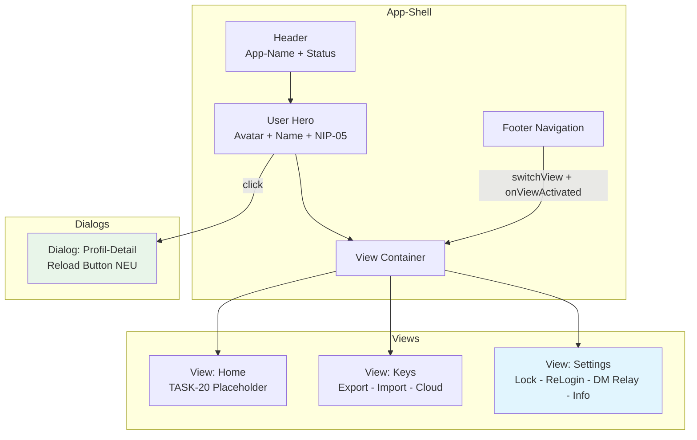

# TASK-17: Sub-Dialoge – Implementierungsplan

## Übersicht

TASK-16 (App-Shell & View-Router) ist bereits vollständig implementiert. TASK-17 erweitert die bestehende Struktur um fehlende Funktionen und bereitet die Settings-View auf TASK-19/20 (NIP-17 DMs) vor.

## Aktueller Stand

### Bereits implementiert (aus TASK-16):

| Komponente | Status | Details |
|------------|--------|---------|
| App-Shell Layout | ✅ | Header, User Hero, View Container, Footer Nav |
| View-Router | ✅ | `switchView()` Funktion |
| Dialog-Management | ✅ | `openDialog()`, `closeDialog()` |
| Profil-Dialog | ✅ | Via User-Hero Klick, `renderProfileCard()` |
| Keys-View | ✅ | Export, Import, Create, Cloud Backup |
| Settings-View | ✅ | WP-Nostr-Lock, ReLogin-Dauer, Instance Info |
| Status-Management | ✅ | `showStatus()` mit Auto-Hide |
| Connection Status | ✅ | `updateConnectionStatus()` |
| User Hero | ✅ | `updateUserHero()` |

### Noch fehlend für TASK-17:

| Komponente | Priorität | Beschreibung |
|------------|-----------|--------------|
| Nachrichten-Relay Setting | Hoch | NEU für TASK-19/20 Vorbereitung |
| Version + Scope Info | Mittel | Info-Zeile in Settings-View |
| View-Aktivierungs-Hook | Mittel | `onViewActivated()` für Zustandssync |
| Reload im Profil-Dialog | Niedrig | Eigenen Refresh-Button |

---

## Implementierungsschritte

### Schritt 1: Nachrichten-Relay Setting (NEU)

**Zweck:** Vorbereitung für TASK-19 (NIP-17 Gift-Wrapped DMs)

**HTML-Erweiterung in `view-settings`:**

```html
<!-- Nachrichten-Relay -->
<div class="settings-section">
  <h3>Nachrichten-Relay</h3>
  <div class="dm-relay-row">
    <input id="dm-relay-url" type="text" placeholder="wss://relay.edufeed.org" />
    <button id="save-dm-relay" class="btn-secondary" type="button">Speichern</button>
  </div>
  <p class="hint">Relay für DM-Empfang/Versand (Kind 10050 / NIP-17). Leer = verwendet Relay des Gesprächspartners.</p>
</div>
```

**JavaScript-Implementierung:**

```javascript
const DM_RELAY_KEY = 'dmRelayUrl';

async function loadDmRelay() {
  const result = await chrome.storage.local.get([DM_RELAY_KEY]);
  return result[DM_RELAY_KEY] || '';
}

async function saveDmRelay(url) {
  const normalized = normalizeRelayUrl(url);
  if (url && !normalized) {
    throw new Error('Ungültige Relay-URL');
  }
  await chrome.storage.local.set({ [DM_RELAY_KEY]: normalized || '' });
  return normalized;
}

// Event Listener
const dmRelayInput = document.getElementById('dm-relay-url');
const saveDmRelayButton = document.getElementById('save-dm-relay');

// Beim Laden
const currentDmRelay = await loadDmRelay();
if (dmRelayInput) dmRelayInput.value = currentDmRelay;

// Speichern
if (saveDmRelayButton) {
  saveDmRelayButton.addEventListener('click', async () => {
    const url = String(dmRelayInput?.value || '').trim();
    saveDmRelayButton.disabled = true;
    try {
      const saved = await saveDmRelay(url);
      showStatus(saved 
        ? `Nachrichten-Relay gespeichert: ${saved}`
        : 'Nachrichten-Relay entfernt (verwendet Gegenüber-Relay).');
    } catch (e) {
      showStatus(`Fehler: ${e.message}`, true);
    } finally {
      saveDmRelayButton.disabled = false;
    }
  });
}
```

---

### Schritt 2: Version + Scope Info

**HTML-Erweiterung in `view-settings`:**

```html
<!-- Erweitert -->
<div class="settings-section">
  <h3>Erweitert</h3>
  <div class="wp-user-meta"><strong>Version:</strong> <span id="extension-version">-</span></div>
  <div class="wp-user-meta"><strong>Scope:</strong> <span id="active-scope">-</span></div>
</div>
```

**JavaScript-Implementierung:**

```javascript
// Version aus manifest laden
const versionSpan = document.getElementById('extension-version');
if (versionSpan) {
  const manifest = chrome.runtime.getManifest();
  versionSpan.textContent = manifest.version || 'unbekannt';
}

// Scope anzeigen
const scopeSpan = document.getElementById('active-scope');
if (scopeSpan) {
  scopeSpan.textContent = activeScope || 'global';
}
```

---

### Schritt 3: View-Aktivierungs-Hook

**Zweck:** Zustand aktualisieren, wenn ein View aktiviert wird

**Erweiterte `switchView()` Funktion:**

```javascript
async function switchView(viewId) {
  // Alle Views deaktivieren
  document.querySelectorAll('.view').forEach(v => v.classList.remove('active'));
  document.querySelectorAll('.nav-item').forEach(n => n.classList.remove('active'));
  
  // Ziel-View aktivieren
  const view = document.getElementById(`view-${viewId}`);
  const navItem = document.querySelector(`[data-view="${viewId}"]`);
  if (view) view.classList.add('active');
  if (navItem) navItem.classList.add('active');
  
  // View-spezifische Initialisierung
  await onViewActivated(viewId);
}

async function onViewActivated(viewId) {
  switch (viewId) {
    case 'keys':
      // Protection Row aktualisieren
      if (protectionRow && activeScope) {
        await refreshSignerIdentity(protectionRow, activeScope, true);
      }
      // Cloud-Backup-Status aktualisieren
      if (cloudBackupMeta) {
        await refreshCloudBackupState(cloudBackupMeta, {
          enableButton: cloudBackupEnableButton,
          restoreButton: cloudBackupRestoreButton,
          deleteButton: cloudBackupDeleteButton
        }, activeScope, activeWpApi);
      }
      break;
      
    case 'settings':
      // ReLogin-Status aktualisieren
      if (unlockCacheState) {
        await refreshUnlockState(unlockCacheState, unlockCacheHint, unlockCachePolicySelect, activeScope);
      }
      // Scope-Anzeige aktualisieren
      const scopeSpan = document.getElementById('active-scope');
      if (scopeSpan) scopeSpan.textContent = activeScope || 'global';
      break;
      
    case 'home':
      // Platzhalter für TASK-20
      break;
  }
}
```

---

### Schritt 4: Reload-Button im Profil-Dialog

**HTML-Erweiterung im Dialog:**

```html
<div class="dialog-header">
  <h2 id="dialog-title">Profil-Details</h2>
  <div class="dialog-header-actions">
    <button id="refresh-profile" class="btn-small" type="button" title="Neu laden">↻</button>
    <button class="dialog-close" id="dialog-close" type="button" aria-label="Schließen">✕</button>
  </div>
</div>
```

**CSS-Erweiterung:**

```css
.dialog-header-actions {
  display: flex;
  align-items: center;
  gap: 8px;
}
```

**JavaScript-Implementierung:**

```javascript
const refreshProfileButton = document.getElementById('refresh-profile');

if (refreshProfileButton) {
  refreshProfileButton.addEventListener('click', async () => {
    refreshProfileButton.disabled = true;
    try {
      const viewer = await loadViewerContext(null, status);
      await persistViewerCache(viewer);
      activeViewer = viewer;
      activeScope = viewer?.scope || 'global';
      activeWpApi = sanitizeWpApi(viewer?.wpApi);
      activeAuthBroker = sanitizeAuthBroker(viewer?.authBroker);
      
      const signerContext = await refreshSignerIdentity(protectionRow, activeScope, !viewer?.isLoggedIn);
      activeRuntimeStatus = signerContext?.runtimeStatus || null;
      
      renderProfileCard(profileCard, profileHint, activeViewer, activeRuntimeStatus);
      updateUserHero(activeViewer, activeRuntimeStatus);
      updateConnectionStatus(Boolean(activeRuntimeStatus?.hasKey));
      
      showStatus('Profil aktualisiert.');
    } catch (e) {
      showStatus(`Aktualisierung fehlgeschlagen: ${e.message || e}`, true);
    } finally {
      refreshProfileButton.disabled = false;
    }
  });
}
```

---

## Datei-Änderungen

| Datei | Änderung |
|-------|----------|
| `popup.html` | Nachrichten-Relay Sektion, Version/Scope Info, Reload-Button im Dialog |
| `popup.css` | `.dm-relay-row`, `.dialog-header-actions` Styles |
| `popup.js` | `loadDmRelay()`, `saveDmRelay()`, `onViewActivated()`, Reload-Handler |

---

## Akzeptanzkriterien (aus TASK-17)

- [x] Klick auf User-Hero öffnet Profil-Dialog mit allen bisherigen Profil-Infos
- [x] Profil-Dialog: Pubkeys (npub + hex) kopierbar, Publish-Button funktioniert
- [x] Keys-View: Export, Import, Erstellen funktionieren wie bisher
- [x] Keys-View: Tresor-Sektion (WordPress Cloud Backup) vollständig eingebaut
- [x] Keys-View: Schutzart-Dropdown oben sichtbar
- [x] Settings-View: ReLogin-Dauer + Status-Badge
- [x] Settings-View: WP-Nostr-Lock Checkbox
- [ ] **Settings-View: Nachrichten-Relay Feld (speichert in storage)** ← NEU
- [x] Alle bisherigen Funktionen aus dem alten Popup bleiben erreichbar
- [x] Status-Meldungen (`#status`) werden view-übergreifend angezeigt
- [ ] **Zustandssynchronisation bei View-Wechsel** ← NEU
- [ ] **Version + Scope Info in Settings** ← NEU

---

## Architektur-Diagramm



---

## Nächste Schritte

1. **Wechsel in Code-Mode** für Implementierung
2. **popup.html** erweitern mit:
   - Nachrichten-Relay Sektion in Settings
   - Version/Scope Info in Settings
   - Reload-Button im Profil-Dialog
3. **popup.css** erweitern mit:
   - `.dm-relay-row` Layout
   - `.dialog-header-actions` Layout
4. **popup.js** erweitern mit:
   - `loadDmRelay()`, `saveDmRelay()` Funktionen
   - `onViewActivated()` Hook
   - Reload-Button Handler
   - Version/Scope Anzeige
5. **Testing** in Chrome und Firefox
