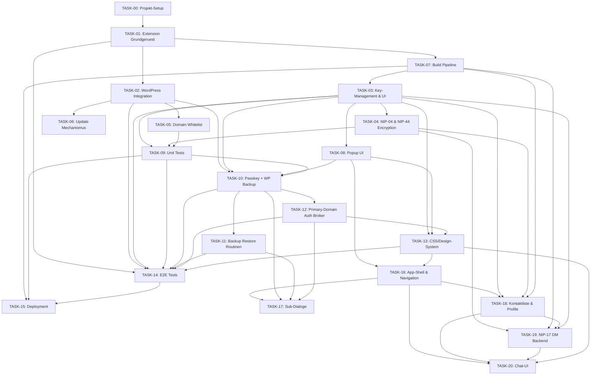

# TASK-00: Projekt-Setup und Uebersicht

## Projekt: NIP-07 Browser Extension fuer WordPress Nostr Integration

### Ziel
Entwicklung einer Browser Extension (Chrome/Firefox), die:
1. NIP-07 Signer-Funktionalitaet bereitstellt.
2. Nahtlos mit WordPress-Instanzen integriert.
3. Automatische Domain-Authentifizierung ueber Whitelist bietet.
4. Sichere Key-Generierung mit Backup/Recovery unterstuetzt.

---

## Architektur-Ueberblick

```text
+-----------------+     +---------------------+     +-----------------+
|  WordPress Site |<--->|  Browser Extension  |<--->|  Nostr Relays   |
|  (PHP/REST API) |     |  (Manifest V3)      |     |  (WebSocket)    |
+-----------------+     +---------------------+     +-----------------+
         ^                        |
         +------------------------+
           Domain Whitelist + Npub Registration
```

---

## Technik-Stack

| Komponente | Technologie | Begruendung |
|------------|-------------|-------------|
| Extension Core | Vanilla JS + WebExtension API | Maximale Kompatibilitaet |
| Nostr Crypto | nostr-tools v2+ (ES Module) | Standard-Implementierung |
| Build Pipeline | Rollup | Bundling fuer MV3 Service Worker |
| WordPress Backend | PHP + REST API | Native Integration |
| Key Storage | Extension Storage API + AES-GCM | Verschluesselung im Browser |
| UI | Vanilla JS + CSS | Keine schweren Dependencies |
| Browser Compat | Chrome + Firefox | Breite Unterstuetzung |

---

## Task-Uebersicht und Abhaengigkeiten

### Reihenfolge der Tasks



### Task-Beschreibungen

| Task | Titel | Abhaengigkeiten | Prioritaet |
|------|-------|----------------|-----------|
| TASK-01 | Extension Grundgeruest | Keine | Hoch |
| TASK-02 | WordPress Integration & Detection | TASK-01 | Hoch |
| TASK-03 | Extension Key-Management & UI | TASK-01, TASK-07 | Hoch |
| TASK-04 | NIP-04 & NIP-44 Encryption | TASK-03 | Mittel |
| TASK-05 | Domain Whitelist | TASK-02 | Mittel |
| TASK-06 | Extension Update Mechanismus | TASK-02 | Niedrig |
| TASK-07 | Build Pipeline & Browser-Kompatibilitaet | TASK-01 | Hoch |
| TASK-08 | Popup UI | TASK-03 | Mittel |
| TASK-09 | Unit Tests | TASK-03, TASK-04, TASK-05 | Hoch |
| TASK-10 | Passkey + WP Backup Recovery | TASK-02, TASK-03, TASK-08, TASK-09 | Hoch |
| TASK-11 | WP Backup Restore Routinen | TASK-10 | Hoch |
| TASK-12 | Primary-Domain Auth Broker | TASK-10 | Hoch |
| TASK-13 | CSS-Design-System (UTF-8, Dark/Light, Blue Glow) | TASK-03, TASK-08, TASK-12 | Mittel |
| TASK-14 | E2E Test-Automatisierung | TASK-01–13 | Hoch |
| TASK-15 | Deployment (Release, Stores, WordPress Rollout) | TASK-07, TASK-09, TASK-14 | Hoch |
| TASK-16 | Popup-Redesign: App-Shell, Navigation & View-Router | TASK-08, TASK-13 | Hoch |
| TASK-17 | Sub-Dialoge: Profil, Schluessel, Settings | TASK-16, TASK-10, TASK-11, TASK-12 | Hoch |
| TASK-18 | Nostr-Kontaktliste & Profil-Aufloesung (Kind 3, Kind 0) | TASK-16, TASK-03, TASK-04, TASK-07 | Hoch |
| TASK-19 | Nostr-Direktnachrichten Backend (NIP-17 Gift-Wrapped DMs) | TASK-04, TASK-07, TASK-18, TASK-03 | Hoch |
| TASK-20 | Chat-UI: Kontaktliste & Nachrichten-Ansicht | TASK-16, TASK-18, TASK-19, TASK-13 | Hoch |

### Aktueller Task-Stand

1. `TASK-00-Projekt-Uebersicht.md`
2. `TASK-01-Extension-Grundgeruest.md`
3. `TASK-02-WordPress-Integration-Detection.md`
4. `TASK-03-Extension-Key-Management-UI.md`
5. `TASK-04-NIP04-NIP44-Encryption.md`
6. `TASK-05-Domain-Whitelist.md`
7. `TASK-06-Update-Mechanismus.md`
8. `TASK-07-Build-Pipeline.md`
9. `TASK-08-Popup-UI.md`
10. `TASK-09-Unit-Tests.md`
11. `TASK-10-Passkey-WP-Backup-Recovery.md`
12. `TASK-11-WP-Backup-Restore-Routines.md`
13. `TASK-12-Primary-Domain-Auth-Broker.md`
14. `TASK-13-CSS-Design-UTF8-Dark-Light-Blue-Glow.md`
15. `TASK-14-e2e-Test.md`
16. `TASK-15-Deoloyment.md`
17. `TASK-16-Popup-Redesign-App-Shell.md`
18. `TASK-17-Sub-Dialoge-Profil-Keys-Settings.md`
19. `TASK-18-Nostr-Kontaktliste-Profil-Aufloesung.md`
20. `TASK-19-Nostr-Direktnachrichten-NIP17.md`
21. `TASK-20-Chat-UI-Kontaktliste-Nachrichten.md`

---

## Projektstruktur (vereinfacht)

```text
wp-nostr-nip7-browser-extension/
|- background.js
|- content.js
|- inpage.js
|- dialog.html / dialog.css / dialog.js
|- popup.html / popup.css / popup.js
|- domain-access.js
|- key-manager.js
|- nostr-auth-broker.js
|- manifest.chrome.json
|- manifest.firefox.json
|- wp-nostr-integration.php
|- nostr-integration.js / nostr-integration.css
|- tasks/
|- dist/
|- scripts/
|- package.json
|- rollup.config.js
|- README.md
```

---

## Globale Sicherheitsregeln (STRICT)

### 1. NSEC Regeln
- `nsec` existiert nur verschluesselt im Extension Storage.
- `nsec` wird nie in den Webseiten-Kontext uebertragen.
- Nach sensitiver Verarbeitung Speicher so gut wie moeglich bereinigen.

### 2. Domain Regeln
- Jede Signatur-Anfrage muss Domain-Validierung bestehen.
- Unbekannte Domains loesen User-Consent aus.
- Whitelist-Updates nur signiert (HMAC) akzeptieren.
- `PING` und `VERSION_CHECK` duerfen ohne Domain-Validierung laufen.

### 3. UI Regeln
- Signaturdialog zeigt klar: Was wird signiert und von welcher Domain.
- Sensitive Event-Arten brauchen explizite Bestaetigung.
- Backup- und Restore-Aktionen benoetigen klare User-Bestaetigung.

### 4. Kommunikationsregeln
- REST-Endpunkte nutzen Nonce-/Session-Validierung.
- Fuer produktive Domains HTTPS erzwingen.
- Message-Bridge nutzt `_id` zur Request/Response-Korrelation.

### 5. Key-Storage Regeln
- Private Keys mit AES-GCM verschluesseln.
- Salt und IV getrennt verwalten.
- Unlock nur zeitlich begrenzt im Memory cachen.

---

## NIP-07 API Referenz

```javascript
window.nostr = {
  getPublicKey: async () => string,
  signEvent: async (event) => SignedEvent,
  getRelays: async () => Object,
  nip04: {
    encrypt: async (pubkey, plaintext) => string,
    decrypt: async (pubkey, ciphertext) => string
  },
  nip44: {
    encrypt: async (pubkey, plaintext) => string,
    decrypt: async (pubkey, ciphertext) => string
  }
};
```

### SignedEvent Format

```javascript
{
  id: string,
  pubkey: string,
  created_at: number,
  kind: number,
  tags: array,
  content: string,
  sig: string
}
```

---

## Ressourcen

- NIP-07: https://github.com/nostr-protocol/nips/blob/master/07.md
- NIP-44: https://github.com/nostr-protocol/nips/blob/master/44.md
- nostr-tools: https://github.com/nbd-wtf/nostr-tools
- WebExtension API: https://developer.mozilla.org/en-US/docs/Mozilla/Add-ons/WebExtensions

---

## Deployment Checkliste

- [ ] `npm test` erfolgreich
- [ ] `npm run build` erfolgreich (Chrome + Firefox)
- [ ] `npm run test:e2e` erfolgreich
- [ ] Store-Pakete erstellt und geprueft
- [ ] WordPress Plugin ausgerollt und API-Endpunkte verifiziert
- [ ] Smoke-Tests: Detection, Signatur, Domain-Sync, Backup/Restore
- [ ] Rollback-Pfad dokumentiert und getestet
