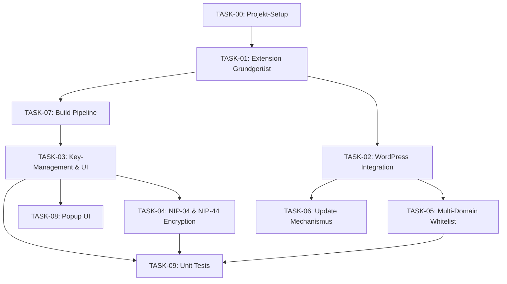

# TASK-00: Projekt-Setup und Übersicht

## Projekt: NIP-07 Browser Extension für WordPress Nostr Integration

### Ziel
Entwicklung einer Browser Extension (Chrome/Firefox), die:
1. NIP-07 Signer-Funktionalität bereitstellt
2. Nahtlos mit WordPress-Instanzen integriert
3. Automatische Domain-Authentifizierung über Whitelist
4. Sichere Key-Generierung mit Backup-Export

---

## Architektur-Überblick

```text
┌─────────────────┐     ┌────────────────────┐     ┌─────────────────┐
│  WordPress Site │◄───►│  Browser Extension │◄───►│  Nostr Relays   │
│  (PHP/REST API) │     │  (Manifest V3)     │     │  (WebSocket)    │
└─────────────────┘     └────────────────────┘     └─────────────────┘
         ▲                        │
         └────────────────────────┘
              Domain Whitelist
              Npub Registration
```

---

## Technik-Stack

| Komponente | Technologie | Begründung |
|------------|-------------|------------|
| Extension Core | Vanilla JS + WebExtension API | Maximale Kompatibilität |
| Nostr Crypto | nostr-tools v2+ (ES Module) | Standard-Implementierung |
| Build Pipeline | Rollup / esbuild | nostr-tools Bundling für MV3 Service Worker |
| WordPress Backend | PHP + REST API | Native Integration |
| Key Storage | Extension Storage API + AES-GCM | Verschlüsselt mit User-Passwort |
| UI | Vanilla JS + CSS | Keine Dependencies |
| Browser Compat | webextension-polyfill | Chrome + Firefox Unterstützung |

---

## Task-Übersicht und Abhängigkeiten

### Reihenfolge der Tasks



### Task-Beschreibungen

| Task | Titel | Abhängigkeiten | Priorität |
|------|-------|----------------|-----------|
| TASK-01 | Extension Grundgerüst | Keine | Hoch |
| TASK-02 | WordPress Integration & Detection | TASK-01 | Hoch |
| TASK-03 | Extension Key-Management & UI | TASK-01, TASK-07 | Hoch |
| TASK-04 | NIP-04 & NIP-44 Encryption | TASK-03 | Mittel |
| TASK-05 | Multi-Domain Whitelist Management | TASK-02 | Mittel |
| TASK-06 | Extension Update Mechanismus | TASK-02 | Niedrig |
| TASK-07 | Build Pipeline & Browser-Kompatibilität | TASK-01 | Hoch |
| TASK-08 | Popup UI | TASK-03 | Mittel |
| TASK-09 | Unit Tests | TASK-03, TASK-04, TASK-05 | Hoch |

---

## Projektstruktur

```text
wp-nostr-nip7-browser-extension/
├── src/
│   ├── background.js        # Service Worker (importiert nostr-tools)
│   ├── content.js           # Bridge Script (kein Bundling nötig)
│   ├── inpage.js            # NIP-07 API (IIFE, kein Import)
│   ├── dialog.js            # Dialog-Logik
│   ├── dialog.html
│   ├── dialog.css
│   ├── popup.html           # Extension Popup
│   ├── popup.js
│   ├── popup.css
│   ├── lib/
│   │   ├── key-manager.js    # KeyManager Klasse (export)
│   │   ├── domain-access.js  # checkDomainAccess() (export)
│   │   ├── semver.js         # semverSatisfies() (export)
│   │   └── crypto-handlers.js # handleNIP04(), handleNIP44() (export)
│   ├── icons/
│   │   ├── icon16.png
│   │   ├── icon48.png
│   │   └── icon128.png
│   ├── manifest.chrome.json # Chrome MV3 Manifest
│   └── manifest.firefox.json # Firefox MV3 Manifest
├── tests/
│   ├── mocks/
│   │   └── chrome.js
│   ├── key-manager.test.js
│   ├── nip07-conformity.test.js
│   ├── nip04-nip44.test.js
│   ├── semver.test.js
│   ├── domain-access.test.js
│   └── message-handler.test.js
├── dist/
│   ├── chrome/
│   └── firefox/
├── wordpress-plugin/
│   ├── wp-nostr-integration.php
│   └── js/
│       └── nostr-integration.js
├── package.json
├── rollup.config.js
├── vitest.config.js
├── AGENTS.md
└── tasks/
    ├── TASK-00-Projekt-Uebersicht.md
    ├── TASK-01-Extension-Grundgeruest.md
    ├── TASK-02-WordPress-Integration-Detection.md
    ├── TASK-03-Extension-Key-Management-UI.md
    ├── TASK-04-NIP04-NIP44-Encryption.md
    ├── TASK-05-Multi-Domain-Whitelist-Management.md
    ├── TASK-06-Extension-Update-Mechanismus.md
    ├── TASK-07-Build-Pipeline-Browser-Kompatibilitaet.md
    ├── TASK-08-Popup-UI.md
    └── TASK-09-Unit-Tests.md
```

---

## Globale Sicherheitsregeln (STRICT)

Diese Regeln gelten für ALLE Tasks und müssen jederzeit eingehalten werden:

### 1. NSEC REGELN
- Nsec existiert NUR im Extension Storage (AES-GCM verschlüsselt mit User-Passwort)
- Nsec wird NIE in den Webseiten-Kontext übertragen
- Nach jeder Verwendung: Memory sofort überschreiben (`fill(0)`)
- Hinweis: JS Garbage Collection kann Kopien im Speicher belassen – dies ist eine inhärente Limitation

### 2. DOMAIN REGELN
- Jede Signatur-Anfrage MUSS Domain-Validierung bestehen
- Unbekannte Domains lösen User-Consent-Dialog aus (Bootstrapping)
- Whitelist wird NUR von autorisierten WordPress-Instanzen aktualisiert (HMAC-signiert)
- User-Bestätigung für neue Domains außerhalb der Whitelist
- PING und VERSION_CHECK sind ohne Domain-Validierung erlaubt (Extension-Detection)

### 3. UI REGELN
- Jede Signatur zeigt klar: WAS wird signiert, WOHER kommt die Anfrage
- Sensitive Events (Kind 0, 3, 4) erfordern explizite Bestätigung
- Backup-Dialog zeigt nsec nur einmal und erzwingt Checkbox-Bestätigung
- Passwort-Dialog muss bei Ersteinrichtung Wiederholung verlangen (min. 8 Zeichen)

### 4. KOMMUNIKATION REGELN
- Alle REST-Endpoints verwenden WordPress Nonce-Validierung
- HTTPS erzwungen für alle Domain-Kommunikationen
- Keine Inline-Scripts, nur externe JS-Files
- Message-Bridge nutzt `_id`-Korrelation für Request/Response-Zuordnung
- Domain-Listen vom Server müssen HMAC-signiert sein

### 5. KEY-STORAGE REGELN
- Private Keys werden mit AES-GCM verschlüsselt (PBKDF2 600.000 Iterations)
- Salt und IV werden separat gespeichert
- Passwort wird nur im Memory gecacht (Service Worker Session, nicht persistiert)
- Bei Service-Worker-Neustart muss User Passwort erneut eingeben

---

## NIP-07 API Referenz

Die Extension muss folgende NIP-07 Standard-API bereitstellen:

```javascript
window.nostr = {
  // Gibt hex-String des öffentlichen Schlüssels zurück (64 Zeichen)
  getPublicKey: async () => string,
  
  // Signiert ein Event und gibt vollständiges Event zurück
  signEvent: async (event) => SignedEvent,
  
  // Gibt konfigurierte Relays zurück
  getRelays: async () => Object,
  
  // NIP-04 Encryption (Legacy)
  nip04: {
    encrypt: async (pubkey, plaintext) => string,
    decrypt: async (pubkey, ciphertext) => string
  },
  
  // NIP-44 Encryption (Recommended)
  nip44: {
    encrypt: async (pubkey, plaintext) => string,
    decrypt: async (pubkey, ciphertext) => string
  }
}
```

### SignedEvent Format
```javascript
{
  id: string,         // 64 hex chars - Event Hash
  pubkey: string,     // 64 hex chars - Public Key
  created_at: number, // Unix timestamp
  kind: number,       // Event type
  tags: array,        // Event tags
  content: string,    // Event content
  sig: string         // 128 hex chars - Schnorr Signature
}
```

---

## Ressourcen

- NIP-07: https://github.com/nostr-protocol/nips/blob/master/07.md
- NIP-44: https://github.com/nostr-protocol/nips/blob/master/44.md
- nostr-tools: https://github.com/nbd-wtf/nostr-tools
- WebExtension API: https://developer.mozilla.org/en-US/docs/Mozilla/Add-ons/WebExtensions

---

## Deployment Checkliste

- [ ] `npm test` alle Tests grün
- [ ] `npm run build` erfolgreich (Chrome + Firefox)
- [ ] Extension in Chrome Web Store hochladen ($5 Fee)
- [ ] Extension bei Firefox Add-ons hochladen (kostenlos)
- [ ] Extension ID in WordPress Plugin hinterlegen
- [ ] WordPress Plugin ZIP erstellen und installieren
- [ ] Test-User: Registrierung, Signatur, Domain-Wechsel
- [ ] Test: Domain-Bootstrapping (neue Domain ohne Whitelist)
- [ ] Test: Backup-Dialog Pflicht (nsec Export, Checkbox)
- [ ] Test: Passwort-Unlock nach Service-Worker-Restart
- [ ] Security Audit: XSS, CSRF, Key-Exposure Tests
- [ ] Verify: getPublicKey() gibt hex zurück, signEvent() gibt vollständiges Event zurück
